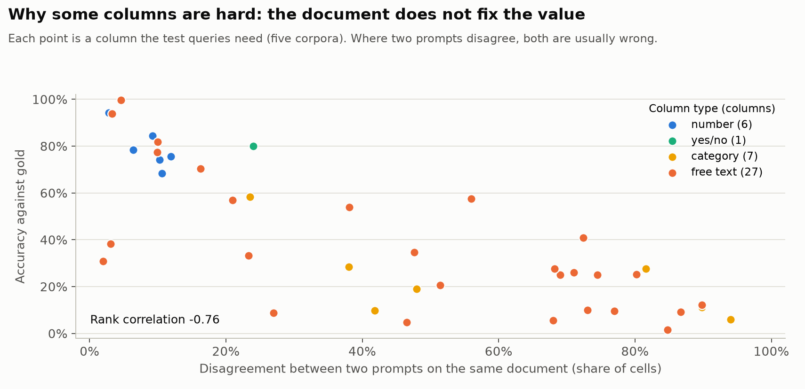
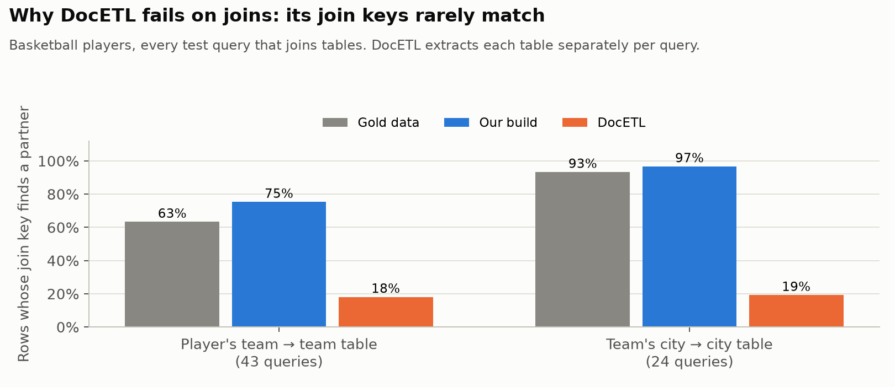
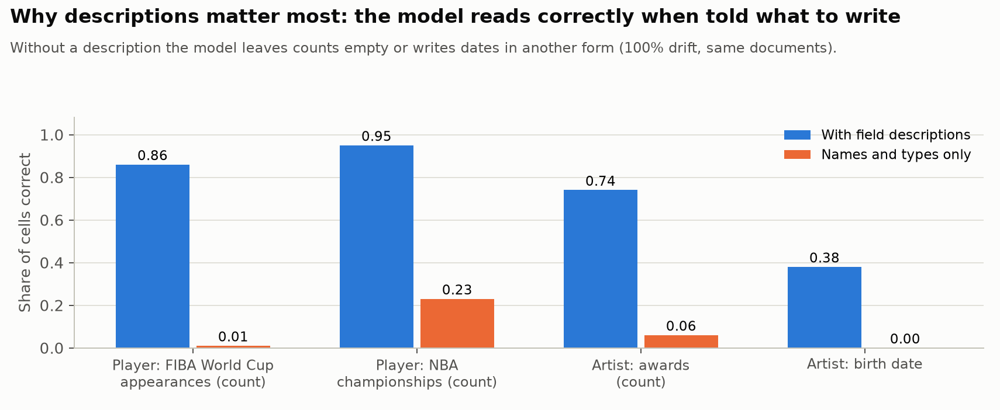

The system builds a database from documents with an LLM. Before queries arrive, it reads every document once for the
columns its known workload uses (the *build*). When a later query needs a column the build skipped, it extracts that
column *on demand*, only for the documents the query can select, and keeps the result for later queries. *Workload
drift* of p% means that p% of the columns needed by the test queries were left out of the build. We use five corpora
(research papers, basketball players, artists, medical documents and court judgments), Qwen 2.5 7B as the main model,
and Qwen 2.5 32B for some comparisons. A query's score is the product of structure F2 and cell F1, averaged over
queries.

Each section below asks why one property of the documents, the columns, the prompt or the workload has the effect it
has. It gives the evidence and the mechanism, says where the effect holds and where we have not tested it, and ends
with what the finding lets someone decide for their own setting. The sections run from the most to the least
transferable, and the last one connects the findings to other areas.

# Why does an extracted value depend on how the question is asked, but not on when?

**Extraction timing turns out to be irrelevant; what matters is the prompt.** Drift only changes which prompt reads a
column: the build asks for all of a table's new columns at once, while an on-demand extraction asks for one to three.
To test this we re-ran the fully drifted workloads with every on-demand extraction given exactly the build's prompt.
**463 of the 467 queries then scored the same as when everything was extracted up front.** One of the remaining
queries (research papers) differs because of how values are mapped to the workload's vocabulary when results are
served, not because of extraction. The other three are on the medical (2 of 43) and legal (1 of 27) corpora, and we
have not yet traced them.

The small gaps we saw earlier between up-front and on-demand scores are therefore prompt effects. With the 7B model
they are too small to be significant. With the 32B model they are not: on research papers the on-demand score is 0.062
higher, and almost all of it comes from one column, whether a method uses single-hop or multi-hop reasoning. Asked
together with six other columns, the model leaves it empty for 64% of papers; asked alone, it fills it for 98%. So an
extracted value is a function of the document *and of the prompt it was asked in*, including which other columns were
asked alongside it. In a conventional database, reading a value twice gives the same value; here it does not.

{width=6.5in}

The timing result holds on all five corpora with the 7B model and on two with the 32B model. The size of the prompt
effect depends on the model: it is small for the 7B model and large for the 32B model on one corpus, and we have not
measured it on other model families.

We then intervened directly. For every column the drifted workload needs and the build lacks, the same thirty sampled
documents were read in five contexts: the column alone, with two random columns of its table, with six, in the build's
natural group, and alone with a paraphrased description (39 columns, 5,005 prompts). **On average the context does not
move accuracy at all, 0.37 to 0.41 in every context, and the direction of its effect is the column's own:** 18 columns
are more accurate alone than in the group by 0.05 or more and 9 are less. How much a column's value changes between
contexts is one property of the column: its sensitivity to adding two random columns, to adding six, to the natural
group and to a paraphrase rank the columns the same way (Spearman 0.82 to 0.93 between every pair), and so do the
changes we had already logged, removing the description, removing the workload-use phrase, regrouping, or cutting long
documents at the window (0.60 to 0.84 between kinds). "Ask for fewer columns at once" is therefore not a knob with a
direction; it is a per-column effect, and in Section 2 we show it is also the measure of how far the document
determines the value.

{width=6.5in}

*What this lets you decide.* Extraction can be deferred until a query needs it without losing accuracy, so a system
does not have to guess the workload correctly to be accurate, only to be cheap. What has to be controlled is the
prompt. Values from different prompts should not be mixed in one column, a store of extracted values should record the
prompt each value came from, and re-extracting a column is a new measurement, not a refresh. The budget section below
shows what happens when this is ignored: delaying an extraction moves it into a different prompt and changes the
answers.

# Why can a column's accuracy be predicted without any gold data?

When a document states a value plainly, as with a number or a yes/no answer, any reasonable prompt returns it. **When
the document does not settle the answer, the prompt decides.** Examples are a disease's causes, a party's status, or a
value the document never mentions. The prompt decides through how readily the model leaves a cell empty and through
the example values it shows. It follows that two different prompts will disagree exactly where the document leaves the
answer open, and that is also where they are likely to be wrong.

We measured, for each column the test queries need, how often the build's prompt and the on-demand prompt give
different values for the same document. **Across 41 columns this disagreement is a strong predictor of error
(Spearman −0.76).** Numbers disagree on 9% of cells, yes/no columns on 24%, free text on 47% and categories on 60%.
No column with more than about 55% disagreement is right more than 60% of the time.

{width=6.5in}

The signal is cheap: estimated from ten sampled documents per column it ranks the columns almost as well as the full
corpus does (Spearman −0.66 against −0.72; five documents give −0.62). The signal also works cell by cell. Where the two
prompts disagree, the served value is wrong 79% of the time; where they agree, 44%. The disagreeing cells are 36% of all cells and hold half of all wrong cells. Checking columns in order
of disagreement finds 69% of the wrong cells after checking half of all cells, close to the 72% that an order chosen
with hindsight finds and well above the 50% of a random order. **The signal fails in one place, and the failure is
informative: on category columns, cells where the prompts agree are wrong more often (57%) than cells where they
disagree (49%).** Both prompts choose the same label from the same list, and when that label is coarser than the gold
one they are consistently wrong. Disagreement catches errors that come from an open answer, not errors that come from
a shared misunderstanding of what the categories mean.

**The property belongs to the column, not to our system.** DocETL extracts the same columns with its own prompts, one
per query. Our two-prompt disagreement on a column predicts DocETL's accuracy on that column almost as well as it
predicts ours (Spearman −0.73 over 40 shared columns), and DocETL's disagreement between its own queries predicts its
own accuracy (−0.63 over 85 columns). Columns that are hard for one system are hard for the other (accuracy rank
correlation 0.64), and list-valued columns are the worst kind in both (16% correct in DocETL against 47% to 66% for
the other kinds).

{width=6.5in}

The medical corpus, whose columns are mostly descriptive judgments, stands out. Its two prompts disagree on 75% of
cells, against 28% to 34% for papers, artists and court judgments and 10% for basketball players. Document length
does not explain this; on the earlier version of the medical and legal queries, prompts disagreed about as often on
short documents as on long ones. With five corpora we cannot separate three properties that occur together in the
medical corpus: descriptive columns, gold values that are often empty, and list-valued columns.

**A sensitive cell is one the document under-determines, and a stronger reader cannot determine it either.** We gave
a 32B model a second look at 1,719 cells the 7B had served, the column asked alone, and allocated a budget of 600 looks
three ways. Spending them on the most sensitive columns first fixed a net 110 errors per thousand looks; spreading them
evenly, 48; at random, 148. Sensitivity does not tell where a second look pays, in either direction (the 600 least
sensitive cells, chosen with hindsight, give 132). What it predicts is the 32B's own accuracy on the column (−0.67,
as it predicts the 7B's, Llama's and DocETL's): in the most sensitive band the 7B is right on 14% of cells and the 32B
on 24%; in the least sensitive band 59% and 80%. The cells a stronger reader repairs are determined ones the weaker
reader misread, which sit in low-sensitivity columns with poor accuracy, such as dates written in another format
(an artist's death date: sensitivity 0.06, 84% of the 7B's errors fixed; birth date 0.12 and 73%). So there are two
kinds of error. *Under-determination* shows as disagreement and is not repaired by asking again, whatever the model;
*misreading* shows as agreement on a wrong value and is repaired by a different reader when the bias was the reader's.
The category exception above is the same distinction: a shared label vocabulary is a bias no reader repairs. (On the
intervention's own sample, which has only two choice-list columns, disagreement did predict error on categories too,
52% right when agreeing against 14% when not; the exception rests on the 41 logged columns.)

{width=6.5in}

*What this lets you decide.* Before any gold data exists, asking a column twice with two cheap prompts on ten or so
documents tells you which columns the documents determine. Where they do not, re-asking is wasted, whatever the
model: change the specification, narrow the vocabulary, or ask a person. Where they do and the column is still wrong,
a different reader is the repair. For categories, agreement is not evidence of correctness, and the category
definitions themselves need checking.

# Why do aggregate queries over extracted values lose their groups?

Looking at individual queries rather than averages, **most failures are the wrong set of groups, and almost always too
few groups.** At 100% drift, 79% of the 290 test queries return groups that differ from the gold answer, 13% return
the right groups with wrong values, 4% return no rows and 5% are fully right. More than half of all queries (55%)
return fewer groups than the gold answer.

**The groups go missing because extraction collapses labels.** For each GROUP BY column we compared the number of
distinct values in the extracted table with the number in the gold table. In 59% of these columns the extraction has
fewer distinct values, and in only 11% it has more. The collapse is strongest on research papers (median ratio 0.67)
and medical documents (0.75), and absent on basketball players and court judgments (1.0), which matches how the
corpora rank overall. The more groups a gold answer has, the more of them are missed: 47% of queries with one to
three gold groups return too few, against 81% of queries with more than thirty.

{width=6.5in}

To see how labels collapse we followed every gold row of every GROUP BY column (17,021 rows) into the extracted table.
49% get the exact gold label. 19% get a label of their own that is spelled differently, so the group survives under
another name. **23% are merged into a label that mostly belongs to a different gold group, and only 9% are left
empty.** Groups therefore disappear mainly because the model draws category boundaries more coarsely than the gold
data, not because it fails to answer.

**Whether a column collapses depends on what kind of value it holds.** GROUP BY columns that hold numbers or years keep
the exact label for 94% of rows, because a number has one obvious way to be written and no boundary to choose. Free
categories keep it for 49%, and the merges follow the model's own idea of the categories: on artists, "20th century"
absorbs the gold groups "19th-20th" and "20th-21st", and on court judgments one case-type label holds 235
administrative, 155 civil and 56 commercial cases. Two-valued columns (yes/no, 0/1) merge 18% of rows, almost always
into the majority answer: "is this the first judgment in the case?" is answered "0" for 261 judgments that are not and
212 that are. Lists of values do worst (29% exact, 32% merged), because the model keeps one item of a list such as
"oral, intravenous" and so joins the group of that single item. This also explains the corpus differences. Medical
columns are mostly lists and free-text categories, and 44% of their rows get a differently spelled label and 19% none,
the highest of any corpus. Basketball players group mostly by short factual values such as team and position and keep
79% exact.

{width=6.5in}

The aggregate decides how much a wrong or missing row matters. We matched predicted and gold groups by their keys and
compared the aggregate values. Averages and sums are within 20% of gold in 54% and 63% of groups because individual
errors partly cancel. MIN is within 20% in 78% of groups and almost never too low (2%): extraction rarely produces a
value smaller than the true minimum, so a minimum only goes wrong when its row is missing. MAX is wrong in both
directions (21% too high, 20% too low), because one inflated value anywhere in the group becomes the maximum. COUNT is
within 20% in only 42% of groups, too low in 33% and too high in 25%, because every row whose label is missing or
merged moves a count.

{width=6.5in}

{width=6.5in}

Averaged over all corpora, AVG queries score 0.38, SUM and MIN 0.32, COUNT 0.21 and MAX 0.17, and this ordering is the
same at every drift level. **Part of that ordering is a property of the aggregate and part is a property of which
corpora the queries come from.** To separate the two we compared each query with the mean score of its own corpus at
the same drift level. MAX stays the worst: its queries are below their corpus mean on all four corpora that have them
(by 0.086 on average). COUNT does not: its queries are slightly above their corpus mean on all five corpora, so its low
pooled score comes from where the COUNT queries are, not from counting. The same comparison confirms the grouping
result: queries that group by a list column are below their corpus mean on all three corpora that have them (by
0.095), and queries that group by a category on three of five. Grouping by free text is not a risk in itself: these
are mostly names such as a team or a judge, which documents state plainly. Only three test queries group by a number,
too few to measure.

Filters and joins follow the same logic. Queries with no filter score lowest (0.23, against 0.29 with one filter),
and 113 of the 119 have wrong groups: without a filter the query groups the whole corpus, so many more groups have to
come out right. With three or more filters the score drops again (0.21), since each condition depends on another
extracted column and the errors compound. Queries with joins score higher (0.30 with one join, 0.38 with two or more),
but all of them are on basketball players, the easiest corpus. Within that corpus the scores are 0.37, 0.44 and 0.38
for zero, one and two or more joins, so joins do not hurt this system, because keys are extracted once and
consistently (see the section on joins). Apart from the within-corpus comparison above, these patterns are
correlational.

*What this lets you decide.* Whether an answer over extracted data can be trusted can be judged from the query before
it runs. Grouping by a number, or by a name the documents state, is safe. Grouping by a list or by a category whose
boundaries are a matter of judgment loses groups, and more so the more groups the answer has. MIN, AVG and SUM tolerate
extraction errors; MAX does not, because one bad value decides it. A system can use this to warn about fragile
queries, to spend its extraction effort on the columns fragile queries group by, or to normalize those columns to a
fixed vocabulary before grouping.

# Do these explanations predict where another system fails?

An explanation that is about columns, values and aggregates, rather than about our system, should predict the
failures of any system that extracts the same columns with an LLM. We checked this on DocETL's outputs for the same
corpora and queries, without changing DocETL. This tests the explanations as predictions; it does not yet test whether
applying them improves DocETL, which needs new runs.

**Most predictions hold.** Where our two prompts disagree on a cell, DocETL's value for that cell is wrong 78% of the
time; where they agree, 38%. The signal is strong for numbers (57% against 28%), lists (84% against 43%) and free text
(80% against 49%). List columns lose the most group labels in DocETL as well (37% of non-empty rows keep the exact
label, against 65% to 74% for the other kinds), and DocETL merges category and yes/no labels at rates close to ours
(19% and 21% of non-empty rows, against our 25% and 18%). MIN is almost never too low in DocETL either (3% of matched groups, ours 2%).
Within each corpus, DocETL's MAX queries are below the corpus mean on four of five corpora, its COUNT queries are above
it on all five, as in our system, and grouping by a list column is below the mean on all three corpora that have one.

{width=6.5in}

**Three predictions fail, and each failure narrows an explanation.** Our disagreement says nothing about DocETL's
yes/no errors (34% against 35%), and on categories it separates them only weakly (49% against 42%). So disagreement
transfers where errors come from the document leaving the answer open, and not where they come from how a system phrases
its labels, which differs between systems. Numbers keep the exact label for only 69% of DocETL's rows, against 96% in
ours, because a quarter of its numbers come back in another form, so "numbers are safe to group by" depends on the
system writing numbers in one form. And DocETL's AVG and SUM queries are below their corpus mean on four corpora, where
ours are not; our explanation that errors cancel in sums and averages assumes that every row is read, and DocETL reads
only the documents each query's own filters keep, so rows go missing rather than errors cancelling.

*What this lets you decide.* Disagreement between two cheap prompts can be used to judge columns for a different
system than the one that produced the prompts, at least for numbers, lists and free text. Which queries to distrust (a
list in the GROUP BY, a MAX) carries over too. Statements that depend on how a system writes values or which documents
it reads, such as the safety of numbers and of averages, have to be checked per system.

# Why is anticipating a column cheap, and when is it worth it?

Anticipating a column costs 2.7 to 5.9 times less than extracting it on demand, and the *break-even probability* (the
chance a future query needs a column above which it is worth reading up front) ranges from 1.3% to 13%. **Both follow
from where the tokens go: every extraction prompt contains the whole document.** Adding one column to a build prompt
that is sent anyway costs only the column's description and its answer, 84 tokens at the median. Extracting the
column later pays for the document again, a median of 745 to 9,537 tokens depending on the corpus, plus 66 tokens of
instructions. The break-even probability should then be close to the ratio of description tokens to document tokens.

**A model built only from these token counts predicts the measured break-even within about 30% on every corpus** and
puts the corpora in the right order:

| Corpus | Median document (tokens) | Predicted | Measured |
|---|---|---|---|
| Research papers | 928 | 9.9% | 13.1% |
| Artists | 745 | 9.3% | 12.2% |
| Basketball players | 995 | 1.7% | 1.3% |
| Medical | 9,537 | 1.7% | 1.9% |
| Court judgments | 4,762 | 2.0% | 1.9% |

On papers and artists the measured value is higher than predicted because on-demand extractions there read only the
documents a query's filters select, which the model ignores.

{width=6.5in}

The other half of the decision is how likely a column is to be needed. In these benchmarks it is high. Of the columns
in each schema, 59% to 86% are used by at least one benchmark query, far above every corpus's break-even. Once one test
query has asked for a column, another asks for it again in 57% to 100% of cases, and within the next ten queries in 36%
to 57%. **By tokens alone, anticipating every column of these schemas would pay.** Two things limit this. Benchmark
schemas are curated, since a column exists because some query uses it, and an open-ended schema would have a much
lower base rate. And asking for more columns in one prompt changes the values, which is the first section's finding:
with the 7B model, asking for fewer columns at once helps on papers and basketball players and hurts on artists.

*What this lets you decide.* Whether to extract a column before anyone asks for it comes down to one comparison: the
probability that the workload will need it against the ratio of the column's description tokens to the document's
tokens. For long documents (thousands of tokens) the threshold is around 2%, and almost any plausibly useful column
should be extracted up front. For short documents it is around 10%, and that is where a known workload saves the most.
A column that has been asked for once is very likely to be asked for again and should be kept. The limit on adding
columns is accuracy, not cost.

# Why can't a budget policy that reasons about cost and timing beat first come, first served?

We tried pacing the budget, capping any single extraction, skipping extractions that bought nothing in hindsight, and
an offline plan that knew the whole workload in advance, on all five corpora. None was reliably better than first
come, first served. The best gain of any policy on any corpus is 0.005 in mean score, and every policy that does not
use hindsight loses on at least one corpus (pacing by 0.010 on basketball players, the offline plan by 0.008 on
research papers). Skipping extractions that bought nothing in hindsight keeps the score and only saves tokens (up to
17% on medical).

**The main reason is that an extraction's value mostly arrives later.** Across the five corpora, 54% to 97% of the
score gain from an extraction goes to later queries that reuse the column, rather than to the query that triggered it
(97% on research papers, 54% on court judgments). Several extractions do nothing for their own query and a lot for
later ones. A policy deciding when a query arrives cannot see this.

{width=6.5in}

**Capping the size of an extraction always loses (by 0.006 to 0.029), because the largest extractions are the most
valuable ones.** In the unlimited runs the rank correlation between an extraction's token cost and its total value is
0.28 to 0.63 on four corpora. A large extraction reads a column for many documents, and many later queries reuse it.
The cap costs least on research papers, the one corpus where size and value are unrelated (correlation −0.01), and
most on basketball players.

**Pacing does not drop extractions, it delays them, so whether it helps depends on two opposing effects.** 89% to
100% of the extractions that pacing skips are made later in the same stream, reading the same documents. The delay
has a predictable cost: queries that arrive while the column is still missing get worse. Among queries where the two
policies hold different columns, pacing loses on four of five corpora (on research papers 8 such queries get worse
and none better). The second effect is not predictable. Once both policies hold the column, its values still differ,
because the delayed extraction ran in a different prompt, next to different columns. These queries move in both
directions and, summed, favour pacing on four corpora and strongly disfavour it on basketball players (49 better, 108
worse). The two effects add up to the observed sign on every corpus: pacing helps on artists, research papers and
medical, and hurts on basketball players and court judgments. **So pacing wins only when re-extracting a column in
different company happens to improve its values by more than the delay costs.** This is the first section's prompt
effect, appearing through the budget.

The offline plan fails for an additional reason: an extraction's cost depends on what was extracted before it. Earlier
extractions make filter columns available, which narrows the documents later extractions read. Under first come, first
served the same query almost always costs the same as without a budget (94% to 100% of cases), but once the plan
removes an extraction's predecessors its cost can jump. In one case it went from 1 document to 29 and no longer fit.

We do not yet have a true upper bound for budget policies, and we have not explained why the value effect turns
against pacing on basketball players.

*What this lets you decide.* A budget policy should be judged by three questions the results above answer. Will the
column be reused? Then its value is mostly in the future and a large extraction is worth more, not less. Does delaying
the extraction change the prompt it runs in? Then the delay changes the answers, and the prompt should be held fixed
per column so that only the timing moves. Does the extraction's cost depend on earlier extractions? Then a plan that
reorders extractions mis-prices them. A policy that forecasts column reuse from the workload, keeps each column's
prompt fixed, and orders extractions so that filter columns come first addresses all three; we have not built it.

# Why does extracting a column for more documents sometimes make answers worse?

**When a column does not apply to a document, the model rarely leaves it empty**, especially when the schema says the
column is never null. Extracting "agent framework" for every paper assigned one to 82 papers that have none. The
budgeted run extracted it only for the papers earlier queries had selected, and was more accurate. More generally, a
budgeted run beats the unlimited one on 8 to 31 queries per corpus, and nearly all of those queries were answered
without an extraction of their own.

The benchmark makes this worse. It marks 19 of the 59 columns on three corpora as never null, although its own gold
data often leaves them empty. Emptying exactly those cells would raise the research-papers score from 0.153 to 0.193.
This rests on case evidence and an oracle measurement; we have not yet counted invented values against applicability
in a controlled way.

*What this lets you decide.* Reading more documents is not free of error even when tokens are cheap. For columns that
apply only to some documents, extraction should be limited to the documents where the column applies, or the prompt
should allow and encourage an empty answer; a schema that declares such a column never null invites invented values.

# Why does a planner that trusts its own extractions stop improving?

**The planner estimates its loss as disagreement with each query's own extraction, which means it treats its own
extractions as correct.** It cannot tell that a shared extraction is more accurate, and once its extractions agree with
each other it sees nothing left to gain. It also values columns one at a time, while a missing join key makes the
whole query fail. On basketball players its best configuration reaches 0.42, against 0.56 for one shared pass with
descriptions. At the full budget it plans only 4.9M of the 10.6M available tokens because its estimated loss is
already 0.027 per query.

*What this lets you decide.* A planner's objective needs some estimate of accuracy that does not come from its own
outputs, for instance a small labelled sample or the disagreement between two prompts, with the caveat for categories
given above. Its value model also has to treat a query's columns jointly, since one missing key loses the whole answer.
We know the cause but have not built such a planner.

# Why do joins fail when each table's keys are extracted separately?

DocETL extracts each table separately for each query. On basketball players its scores drop from 0.125 for queries
without joins to 0.034 with one join and 0.008 with two or more. **A join only matches rows whose keys agree, and keys
extracted independently mostly do not.** In DocETL's per-query tables, 18% of player rows find their team and 19% of
team rows find their city. In our build the figures are 75% and 97%, and in the gold data 63% and 93% (the gold data
contains players whose team has no row of its own). Our build extracts each table's keys once with the same field
definitions, and later queries reuse them.

{width=6.5in}

We then changed DocETL to find out. Each column is extracted once, by the first query that needs it and in that query's
own prompt, and every later query reuses the value. On papers and players this cuts DocETL's calls fifteen-fold but
loses accuracy (papers 0.122 → 0.059, players 0.108 → 0.054), and the per-column numbers show why: in DocETL's
original run the share of documents for which a column is filled at all ranges from 1% to 100% depending on which
query's prompt extracted it (paper name: 44 prompts, median fill 0.53, the first query's 0.01). *Per-query extraction
is a lottery over contexts, and freezing on the first draw makes every later query hostage to it.* Joins still improve
(0.022 → 0.041; player–team keys matching 0.19 → 0.30), because even a poor key is the same key everywhere.
Freezing instead on the better of a column's first two contexts, chosen without labels by the share of documents it
fills, recovers it: **on players DocETL then scores 0.145 to 0.164 in two runs against its own 0.108, with join
queries at 0.029 to 0.055 against 0.022 and about 60 queries better against 35 worse, at a twelfth of the calls**; on
papers 0.101 against 0.122 at an eighth. Keeping drawing contexts until one fills half the documents (at most four)
gives 0.113 on papers at a fifth of the calls and 0.119 on players. The two runs differ because DocETL sets no
temperature and so samples its answers: the same prompt on the same documents returns the same value only 69% to
100% of the time, which is a third reason a stored value is not "the" value, besides the prompt's context and the
model, and it applies to the original per-query run as well. The gain is largest where queries join and group and
smallest where they filter single tables. And it comes despite the frozen values being *less* accurate per column
than the original's pooled values (draft pick 0.95 → 0.63): one value per cell, the same for every query and agreeing
across tables, is worth more to a join or a GROUP BY than a higher accuracy that differs from query to query.

{width=6.5in}

Basketball players is the only corpus with joins, so the join part rests on one corpus.

*What this lets you decide.* Join keys should be extracted once, with one definition, and shared by every query that
joins on them; more generally a stored value should be the same for every query that reads it, and the context it is
frozen on should be chosen for how well it determines the column, not for which query came first. This is the first
section's finding applied to a store: consistency of a value across its uses matters more than the accuracy of any one
extraction of it.

# Why does telling the model what a column means matter so much?

This one is expected and not new: UDA-Bench already evaluated DocETL with field descriptions in its prompts. We include
it because its size puts the other effects in perspective. Given only a column name, the model often does not know
what to write, whether that is a count, a list of years, or a date in a particular format, so it leaves the cell empty
or writes the value in another form. Without descriptions in the on-demand prompts, a count of FIBA World Cup
appearances falls from 0.86 to 0.01 correct, an artist's award count from 0.74 to 0.06, and birth dates from 0.38 to
0.00. Adding the benchmark's descriptions to a single extraction pass raised its score from 0.234 to 0.560, larger than
any scheduling or budget effect we measured.

{width=6.5in}

*What this lets you decide.* Describing each column (its unit, its format, what to write when the document is silent)
comes before any scheduling or budgeting decision. The columns that need it most are the ones flagged by disagreement
between prompts, and categories whose labels the model draws differently from the data.

# What carries over to other problems

Several of these findings are instances of ideas known in other areas, and the comparison shows what is new about an
LLM as the reader of the data.

*Prefetching and shared scans.* Whether to anticipate a column is the classic prefetching decision: fetch ahead when
the probability of use exceeds the ratio of the cost of fetching ahead to the cost of a miss. Databases make the same
argument for shared scans, where one pass over a table serves several queries. What is specific to LLM extraction is
the size of that ratio. Because the document dominates every prompt, an extra column costs 1% to 13% of a separate
read, so the threshold is low and a workload forecast matters only for short documents. The cost model is simple
enough to apply to any pipeline that sends documents to an LLM, such as retrieval-augmented generation or labelling.

*Caching and materialized views.* Reuse of extracted columns is a materialized view over the documents, and its value
comes from future queries, as with any cache. The difference is that the view's contents depend on how they were
computed. A cache of LLM outputs keyed only by document and column will mix values from different prompts, and a
refresh is a new measurement rather than a recomputation. The pacing result is a direct example: moving an extraction
in time changed its values.

*Agreement as a signal of reliability.* Asking twice and comparing is the idea behind self-consistency in LLM question
answering and behind inter-annotator agreement in crowdsourcing. Our results show it works at the level of a column,
across prompts and across systems: our disagreement predicts DocETL's accuracy. They also show the known limit of
agreement among annotators who share a bias. On categories both prompts make the same coarse choice, so agreement does
not mean correctness. This, and the aggregate and label patterns below, are the transfers we tested directly on
DocETL; the others in this section are arguments by analogy.

*Measurement error in aggregates.* The aggregate results are robust statistics in another guise. A maximum depends on a
single observation, so one inflated value decides it; a minimum is safe when errors only push values up; averages and
sums let errors cancel; counts move with every misclassified row. Anyone running analytics over labels produced by a
model can predict which aggregates to trust from the direction and kind of the labelling errors.

*Entity resolution and data integration.* The join result is the familiar requirement that records from different
sources agree on a canonical key before they can be linked. Extraction by an LLM reproduces the problem inside one
system as soon as keys are extracted more than once.

*Data documentation.* Describing each column had the largest effect in the study, which UDA-Bench had already shown for
DocETL. For an LLM reader, schema documentation is not optional metadata but an input that decides accuracy.

# Open questions

Several things remain unexplained. With the 7B model, asking for fewer columns helps on papers and players and hurts
on artists, and we do not know why the direction depends on the corpus. Grouping columns matters for the 32B model
but barely for the 7B model. We cannot yet say how much of the medical corpus's prompt sensitivity comes from each of
the three properties listed above, or what the best achievable budget policy is. The findings also have not been
tested beyond five corpora and three models, or on a different split of the workload into known and later queries.
Two changes to DocETL have been tested (freezing each column on one context); whether keeping drawing contexts until
one determines a column, a budget policy that forecasts reuse with frozen contexts, and choosing the build's prompt
groups by each column's measured context effect improve matters are running (I3c, I4, I5 in RESEARCH_DEPTH.md), as is
the context intervention on the 32B.

# Methods

All analyses in this document reuse existing runs and needed no new model calls. The timing test re-ran the drifted
workloads from logged model responses, with on-demand extractions given the build's prompt. The cost model counts the
tokens of each new column's description and answer, of the instructions, and of up to 60 documents per table (split
into chunks as the system splits long documents); it compares the tokens added to build prompts with the tokens of a
one-column on-demand prompt. Value timing uses, for every on-demand extraction in the unlimited runs, the score change
of its own query and of later queries that use its columns. The specification and determinacy results compare cell
values with the gold data per column; determinacy uses the 41 columns with at least ten documents. The join analysis
checks, for each basketball-player query with a join, how many rows' keys appear in the joined table. The query
breakdown uses, for every test query and drift level, its structure and value scores and its predicted and gold row
counts; the label analysis counts distinct values per GROUP BY column in the served and gold tables, and the aggregate
analysis runs each query on both and compares values in groups matched by key. The label-fate analysis assigns each
predicted label to the gold group that most of its rows belong to, and classifies every gold row as exact, own label
in another form, merged into another group's label, or empty. The pacing analysis compares each paced stream with
the first-come stream at the same budget and drift level, query by query, and records whether the two held the same
needed columns when the query arrived. The disagreement check compares, for every cell of the 41 new columns, the
served value with the build's value and with gold. The DocETL comparisons pool every non-empty value DocETL produced
for a column across its per-query outputs (a query that did not process a document leaves it empty), and measures its
disagreement on documents that two or more queries extracted. The need analysis counts the schema columns that any
benchmark query uses and, in the fully drifted stream, how often a new column is asked for again. The within-corpus
query comparison subtracts each corpus's mean score at the same drift level before averaging by aggregate or by kind
of GROUP BY column. The context intervention reads thirty sampled documents per table (those with a gold row and at most
9,000 tokens) in five contexts with the drift run's prompt renderer and generation settings; sensitivity to a context
is the share of documents whose normalized value differs from the lone answer. The second looks re-ask the 32B, column
alone, for cells of the new columns at 100% drift in documents of at most 6,000 tokens; a look catches an error when the
served value is wrong and the new one right, and introduces one in the opposite case. The frozen DocETL runs keep
DocETL's prompt, documents, model, scoring and query order, and only reuse a column's values across queries once it has
been extracted by the first (or the better of the first two) queries that needed it. For DocETL, the same label, aggregate and within-corpus analyses run on its per-query
outputs and scores for the queries in the current catalogue; labels are compared on non-empty rows, because DocETL fills
a column only for the documents a query's filters keep. Label comparisons treat numbers as numbers in both systems.

# Appendix: example test queries

Each test query is a benchmark query with one column replaced by a column the build did not read. A few per corpus, chosen to cover the aggregates and, where the corpus has them, joins and several filter conditions.

## Research papers (59 test queries)

```sql
SELECT performance_on_NQ, COUNT(paper_name) AS count_papers FROM cspaper WHERE uses_reranker = 'Yes' GROUP BY performance_on_NQ
```

```sql
SELECT retrieval_method, SUM(baseline_amount) AS sum_baseline_amount FROM cspaper WHERE uses_reranker = 'No' OR performance_on_hotpotqa = 'F1: 62.2' OR baseline = 'Traditional RAG' GROUP BY retrieval_method
```

```sql
SELECT agent_framework, MAX(baseline_amount) AS max_baselines FROM cspaper WHERE agent_framework IN ('Other', 'Multi-Agent Collaboration') AND NOT baseline_amount IS NULL GROUP BY agent_framework
```

```sql
SELECT CASE WHEN retrieval_method LIKE '%Hybrid%' THEN 'Hybrid' WHEN retrieval_method LIKE '%Graph-based%' THEN 'Graph-based' WHEN retrieval_method LIKE '%Dense%' THEN 'Dense' WHEN retrieval_method LIKE '%Sparse%' THEN 'Sparse' WHEN retrieval_method LIKE '%Web Search%' THEN 'Web Search' WHEN retrieval_method <> '' THEN 'Other' END AS retrieval_family, agent_framework, COUNT(*) AS paper_count FROM cspaper WHERE retrieval_method <> '' AND agent_framework IN ('Other', 'Multi-Agent Collaboration') GROUP BY retrieval_family, agent_framework
```

## Basketball players (118 test queries)

```sql
SELECT t.team_name, COUNT(*) AS player_count, AVG(p.draft_pick) AS avg_age, SUM(CASE WHEN NOT p.olympic_gold_medals IS NULL THEN p.olympic_gold_medals ELSE 0 END) AS total_recorded_olympic_golds FROM player AS p JOIN team AS t ON TRIM(p.team) = TRIM(t.team_name) GROUP BY t.team_name HAVING COUNT(*) >= 2
```

```sql
SELECT player.team, SUM(player.nba_championships) AS sum_player_mvp_awards FROM player JOIN team ON player.team = team.team_name JOIN city ON team.location = city.city_name WHERE player.age > 28 GROUP BY player.team
```

```sql
SELECT player.position, MAX(player.draft_year) AS max_player_mvp_awards FROM player JOIN team ON player.team = team.team_name JOIN city ON team.location = city.city_name GROUP BY player.position
```

```sql
SELECT player.team, AVG(player.draft_year) AS avg_player_age FROM player JOIN team ON player.team = team.team_name JOIN city ON team.location = city.city_name WHERE (city.city_name = 'Los Angeles') OR (player.mvp_awards >= 1) GROUP BY player.team
```

## Artists (43 test queries)

```sql
SELECT zodiac, COUNT(birth_date) AS count_art_institution FROM art GROUP BY zodiac
```

```sql
SELECT genre, AVG(awards) AS avg_age FROM art WHERE birth_country = 'British India' OR teaching <> 0 GROUP BY genre
```

```sql
SELECT nationality, MAX(age) AS max_age FROM art WHERE tone = 'Warm' GROUP BY nationality
```

```sql
SELECT nationality, COUNT(*) AS artist_count FROM art WHERE tone IN ('Bright', 'Dark') AND nationality <> '' GROUP BY nationality HAVING COUNT(*) >= 5
```

## Medical (43 test queries)

```sql
SELECT prescription_status, COUNT(recommended_usage) AS count_side_effects FROM drug WHERE administration_route <> 'inhalation' GROUP BY prescription_status
```

```sql
SELECT disease.complications, COUNT(disease.treatments) AS count_disease_treatments FROM drug JOIN disease ON drug.disease_name = disease.disease_name GROUP BY disease.complications
```

```sql
SELECT prescription_status, COUNT(mechanism_of_action) AS count_generic_name FROM drug WHERE (administration_route = 'injection') AND (administration_route <> 'subcutaneous') GROUP BY prescription_status
```

## Court judgments (27 test queries)

```sql
SELECT CASE WHEN case_type IN ('Administrative Case', 'Civil Case', 'Commercial Case') THEN case_type ELSE 'Other' END AS case_family, COUNT(*) AS case_count FROM legal WHERE fine_amount IN ('0', '5000', '20000') GROUP BY case_family
```

```sql
SELECT CASE WHEN verdict IN ('Dismissed', 'Approved', 'Others') THEN verdict ELSE 'Other' END AS verdict_family, AVG(legal_basis_num) AS avg_statutes FROM legal WHERE judgment_year = '2009' AND case_number >= 3 GROUP BY verdict_family
```

```sql
SELECT evidence, MIN(judgment_year) AS min_hearing_year FROM legal GROUP BY evidence
```

```sql
SELECT verdict, MIN(legal_basis_num) AS min_legal_basis_num FROM legal WHERE fine_amount = '20000' AND defendant <> 'Construction, Forestry, Mining and Energy Union' AND fine_amount <> '70000' GROUP BY verdict
```

