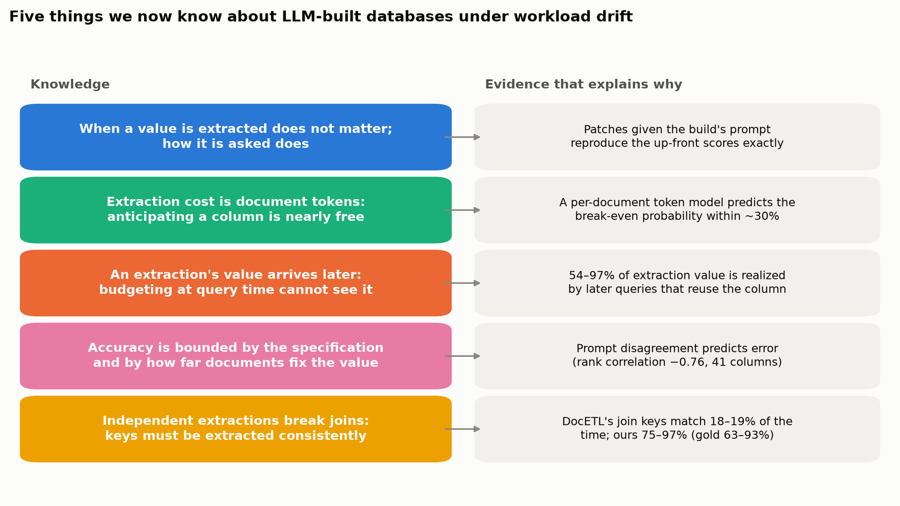
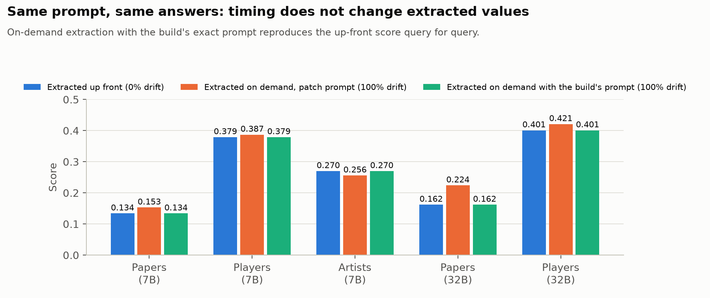
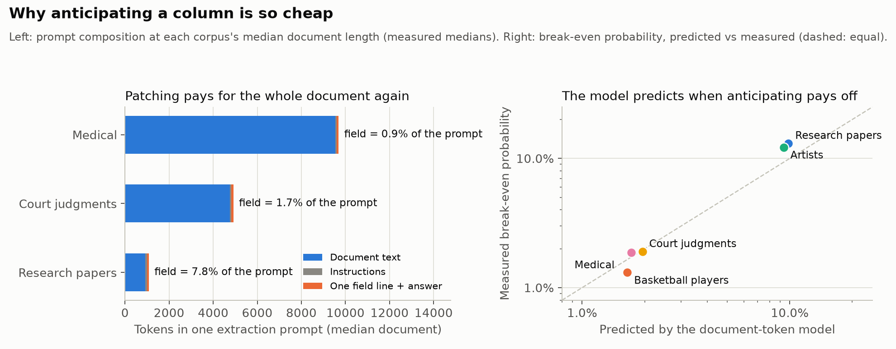
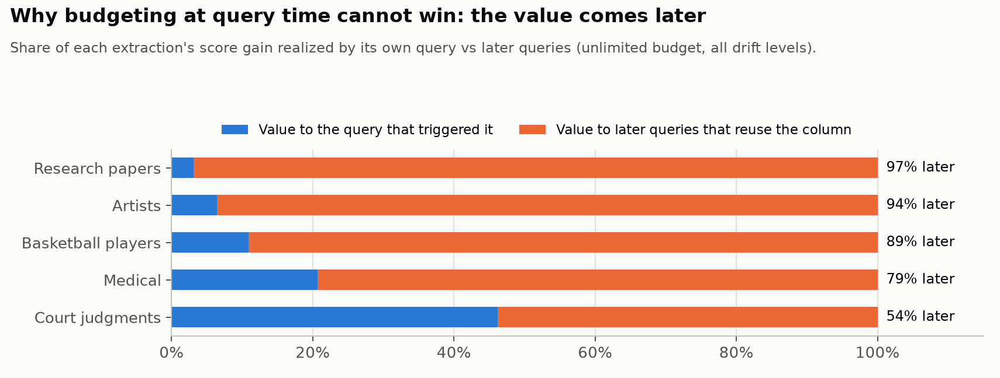

# Purpose of this section

The experiments describe how an LLM-built database behaves when its query workload changes. This section turns those
observations into knowledge: for each finding it asks *why* the system behaves that way, states the mechanism we
identified, shows the evidence, and says how strong that evidence is and what is still open.

**Setting in brief.** An LLM reads each document and fills table columns so that SQL queries can be answered. Before
any query arrives, a *build* reads every document once for the columns the known workload uses. When a later query
needs a column the build did not read, the system extracts it *on demand* (an on-demand extraction, or patch): it
reads that column on the documents the query can select and keeps it for later queries. *Workload drift* of p% means
p% of the columns the test queries need were left out of the build. Scores are per query (right rows and groups ×
right values), averaged; 1.0 is a perfect answer. Five corpora: research papers, basketball players, artists,
medical documents, court judgments. Main model: Qwen 2.5 7B, served locally; some results also with Qwen 2.5 32B.

{width=6.5in}

# 1. When a value is extracted does not matter; how it is asked does

**Why question.** Why does on-demand extraction reach the same accuracy as extracting everything up front, even when
the build anticipated none of the columns a query needs?

**Mechanism.** An extracted value depends on the prompt that asks for it (which columns are asked together and how each
is described), not on when the prompt is sent or which other queries came before. Drift changes only *which prompt*
reads a column: the build asks for all of a table's new columns at once, an on-demand extraction for one to three.

**Evidence.** We re-ran the fully drifted workloads with every on-demand extraction given exactly the build's prompt.
396 of 397 queries then scored exactly as with everything extracted up front (the one difference comes from how values
are mapped to the workload's vocabulary when results are served). The small differences between up-front and
on-demand scores are therefore prompt effects, not drift effects. With the larger model the prompt effect is large
enough to be significant (research papers +0.062): one column ("single-hop or multi-hop reasoning") is left empty on
64% of papers when asked together with six other columns and filled on 98% when asked alone.

{width=6.5in}

**Strength.** Established on three corpora with the 7B model and two with the 32B model; the same test on the medical
and legal corpora is running.

**Implication.** A system can defer extraction without losing accuracy. Prompt design, not extraction timing, is what
to control.

# 2. Extraction cost is dominated by document tokens, so anticipating a column is nearly free

**Why question.** Why is reading a column up front 2.7–5.9× cheaper than extracting it later, and why does the
break-even probability (anticipate a column if the chance a future query needs it exceeds this) range from 1.3% to 13%
across corpora?

**Mechanism.** Every extraction prompt contains the document. Adding one more column to a build prompt that is sent
anyway costs only that column's description line and its answer (median 84 tokens). Extracting the same column later
pays for the whole document again (median 745 to 9,537 tokens depending on the corpus) plus the instructions (66
tokens). The break-even probability is therefore roughly *description tokens ÷ document tokens*.

**Evidence.** A per-document model built only from these token counts predicts each corpus's measured break-even
probability within about 30%, and orders the corpora correctly:

| Corpus | Median document (tokens) | Predicted break-even | Measured break-even |
|---|---|---|---|
| Research papers | 928 | 9.9% | 13.1% |
| Artists | 745 | 9.3% | 12.2% |
| Basketball players | 995 | 1.7% | 1.3% |
| Medical | 9,537 | 1.7% | 1.9% |
| Court judgments | 4,762 | 2.0% | 1.9% |

Where the measured value exceeds the prediction (papers, artists), on-demand extractions read fewer documents than the
model assumes, because they read only the documents a query's filters can select.

{width=6.5in}

**Strength.** Established on all five corpora.

**Implication.** On corpora with long documents, almost any plausibly useful column is worth extracting up front
(break-even about 2%). With short documents the threshold is about 10%. Workload awareness matters most for cost when
documents are short and schemas are wide.

# 3. An extraction's value arrives later, so budgeting at query time cannot see it

**Why question.** Why do budget policies (pacing the budget, capping any single extraction, skipping extractions that
bought nothing, even an offline plan that knows the whole workload) fail to beat simply extracting whatever fits,
first come, first served?

**Mechanism.** Most of an extraction's value goes to *later* queries that reuse the column, not to the query that
triggered it. A policy deciding when a query arrives cannot see that value. A plan made in hindsight fails for a second
reason: an extraction's cost depends on what was extracted before it (earlier extractions make filter columns
available, which narrows the documents later extractions must read), so the costs a plan assumes change when the plan
changes.

**Evidence.** Across all five corpora, 54–97% of the score gain from an extraction is realized by later queries
(research papers 97%, artists 94%, players 89%, medical 79%, court judgments 54%). Several extractions improve nothing
for their own query and everything for later ones. When the same query extracts under a budget, its cost is usually
unchanged (94–100% of cases), but when a plan removes its predecessors it can grow sharply (one chosen extraction grew
from 1 to 29 documents and no longer fitted the budget).

{width=6.5in}

**Strength.** The value timing is established on five corpora; the budget-policy comparison itself covers three
corpora (medical and legal are running). No true upper bound for budget policies exists yet.

**Implication.** Budgeted on-demand extraction is a sequential decision problem in which value is deferred and shared.
Policies need forecasts of future column use, not per-query value estimates.

# 4. Accuracy is bounded by the specification: the model reads correctly when told what to write

**Why question.** Why do field descriptions matter more than anything else we varied (budgets, prompt width, extraction
order, a planner)?

**Mechanism.** Most extraction errors are errors of specification, not of reading. Given only a column name, the model
does not know what to write (a count, a list of years, a date in some format) and leaves the cell empty or writes it in
another form. Values that are right in substance are often wrong in the exact form a query groups or compares by.

**Evidence.** Removing the descriptions from on-demand extraction prompts drops a count of FIBA World Cup appearances
from 0.86 to 0.01 correct (the model leaves it empty), an artist's award count from 0.74 to 0.06, and birth dates from
0.38 to 0.00 (written in another form). On one artist column, values are right in substance 92% of the time but in
exact form only 13%. Adding the benchmark's descriptions to a single extraction pass raises its score from 0.234 to
0.560, the largest effect we measured.

{width=6.5in}

**Strength.** Established by cell-level comparisons against the gold data. A causal test, rewriting ambiguous
descriptions and measuring the gain, has not been run.

**Implication.** Effort spent on the schema contract (what each column means and how to write it) pays more than effort
spent on extraction scheduling.

# 5. Some columns are hard because the document does not fix the value

**Why question.** Why do some columns, and some corpora, react far more to how they are prompted than others?

**Mechanism.** Where a document states a value plainly (a number, yes or no), any reasonable prompt returns it. Where
it does not determine a single answer (a disease's causes, a party's status, a value the document never mentions),
the prompt decides: how readily the model leaves a cell empty, and which example values the prompt shows.

**Evidence.** For each column the test queries need, we measured how often two prompts (the build's and the on-demand
one) give different values for the same document. Across 41 columns this disagreement strongly predicts inaccuracy
(rank correlation −0.76). Numbers disagree on 9% of cells, yes/no on 24%, free text on 47%, categories on 60%. No
column with more than about 55% disagreement is right more than 60% of the time. Some columns agree and are still
wrong (both prompts make the same error of form), so agreement is necessary, not sufficient. By corpus, the two
prompts disagree on 75% of cells for the medical corpus, whose columns are descriptive judgments, against 28–34% for
papers, artists and court judgments and 10% for basketball players. Document length does not explain this: within a
corpus, prompts disagree about as often on short documents as on long ones (measured on the earlier version of the
medical and legal test queries).

{width=6.5in}

**Strength.** Correlational. With five corpora we cannot separate three properties that occur together in the
medical corpus: descriptive columns, gold values that are often empty, and list-valued columns.

**Implication.** Disagreement between two cheap prompts is a usable signal for which columns need better
specification or human review, before any gold data exists.

# 6. Models cannot reliably say "not applicable", so reading less can be more accurate

**Why question.** Why does extracting a column for more documents sometimes lower accuracy, and why does a smaller
budget sometimes beat an unlimited one?

**Mechanism.** When a column does not apply to a document, the model rarely leaves it empty, especially when the
schema says "never null". Extracting a column only for the documents a query can select avoids asking where the answer
should be "not applicable".

**Evidence.** Extracting "agent framework" for every paper assigned one to 82 papers that have none; the budgeted run
extracted it only for the papers earlier queries had selected and was more accurate. A budgeted run beats the
unlimited one on 8–31 queries per corpus, nearly all of them answered without their own extraction. The benchmark marks
columns "never null" that its own gold data often leaves empty (19 of 59 columns on three corpora); emptying exactly
those cells would raise the research-papers score from 0.153 to 0.193.

**Strength.** Case evidence and an oracle measurement; no controlled count of invented values against applicability
yet.

**Implication.** Restricting extraction to applicable documents is a correctness feature, not only a cost saving.
Benchmarks should check their "never null" metadata against their gold data.

# 7. Joins need consistently extracted keys

**Why question.** Why does DocETL, which extracts each table separately for each query, collapse on queries that join
tables (basketball players: 0.125, 0.034 and 0.008 for queries with 0, 1 and 2 or more joins), while our system does
not?

**Mechanism.** A join matches rows only if the key values extracted from both tables agree. Extracting each table
independently, per query, produces key values that do not match. Our build extracts every table's keys once, with the
same field definitions, and later queries reuse them.

**Evidence.** In DocETL's per-query tables, only 18% of player rows find their team and 19% of team rows find their
city. In our build the figures are 75% and 97% (gold data: 63% and 93%; the gold data contains players whose team has
no row of its own).

{width=6.5in}

**Strength.** Established on the one corpus with joins.

**Implication.** Systems that extract per query must coordinate key extraction across tables; reuse gives this for
free.

# 8. Optimizing extraction without an accuracy signal optimizes consistency

**Why question.** Why does a cost-based extraction planner never reach a single shared extraction pass with good field
descriptions, and leave much of its budget unspent?

**Mechanism.** The planner estimates its loss as disagreement with each query's own extraction, so it treats its own
extractions as the truth. It cannot recognise that a shared extraction is more accurate, and once its own extractions
agree it sees nothing left to gain. It also values columns one at a time, while a missing join key makes a whole
query fail.

**Evidence.** On basketball players, the planner reaches 0.42 at best against 0.56 for one shared pass with
descriptions, and at the full budget plans only 4.9M of 10.6M available tokens because its estimated loss is already
0.027 per query.

**Strength.** The cause is diagnosed; a planner with a different objective has not been built or tested.

**Implication.** Extraction planners need an accuracy estimate (a small labelled sample, or agreement across
independent prompts as in finding 5), and must value join keys at the query level.

# What we cannot explain yet

- Why the direction of the prompt effect differs by corpus with the 7B model (asking for fewer columns helps on papers
  and players and hurts on artists), and why grouping alone matters for the 32B model but barely for the 7B model.
- How much of the medical corpus's prompt sensitivity is due to descriptive columns, to often-empty gold values, or
  to list values (they occur together).
- What the best achievable budget policy is (no true upper bound yet).
- Whether the findings hold beyond five corpora and three models, and on a redrawn split of the workload into known
  and later queries.

# Proposed contributions for the paper

1. Extraction timing does not affect accuracy; the prompt does (finding 1).
2. Extraction cost is document-dominated, which makes anticipation cheap and gives a simple rule for when to
   anticipate a column (finding 2).
3. Extraction value is deferred and shared, which is why budget policies cannot beat first-come-first-served
   (finding 3).
4. Accuracy is bounded by specification and by how far documents determine the value; inter-prompt disagreement
   measures the latter without gold data (findings 4 and 5).

# How these analyses were done

All analyses in this section use existing runs; none required new model calls.

- **Timing vs prompt (1):** fully drifted workloads re-run with every on-demand extraction given the build's exact
  prompt, served entirely from logged model responses; per-query scores compared with the up-front runs.
- **Cost model (2):** for each corpus, the token count of each new column's description line and answer, of the
  instructions, and of each document (chunked as the system chunks long documents) for up to 60 documents per table;
  predicted break-even = added build tokens ÷ tokens of a one-column on-demand prompt; measured break-even = extra build
  tokens to anticipate every new column ÷ on-demand extraction tokens at 100% drift.
- **Value timing (3):** for every on-demand extraction of the unlimited runs (all drift levels), the score gain of its
  own query and of later queries that use the extracted columns without extracting them again.
- **Specification (4):** the same workloads with field descriptions removed from on-demand prompts; cell correctness
  against gold per column.
- **Determinacy (5):** for each new column, the share of documents where the build's and the on-demand prompt's values
  differ, against the mean correctness of both; Spearman rank correlation over 41 columns with at least 10 documents.
- **Join keys (7):** for each basketball-player test query with a join, the share of rows whose join key appears in the
  joined table, in DocETL's per-query tables, in our served tables and in the gold data.
