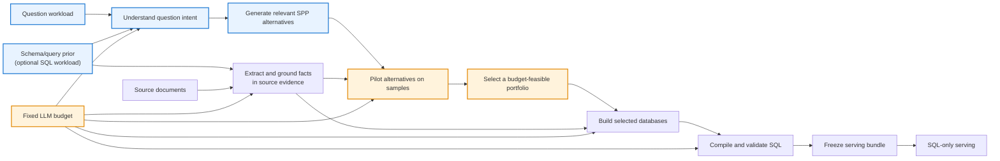
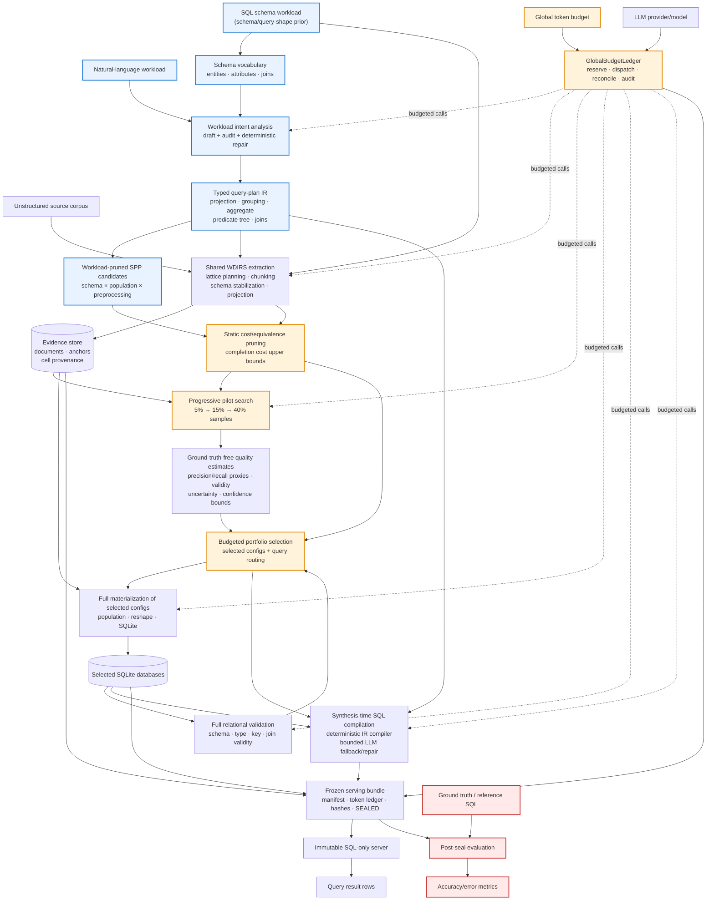

# Workload- and Budget-Aware SPP System

## What problem does the system solve?

The system turns a collection of unstructured documents into a small relational
database service for a known workload of questions.

It is designed for situations in which there is not one universally best
database design. A denormalized table might make one question easy, while a
normalized schema may make another question more reliable. Similarly, a more
expensive population method might improve entity matching but consume too much
of a fixed LLM budget.

SPP stands for:

- **Schema**: how extracted facts are organized into tables and relationships.
- **Population**: how records are reconciled, normalized, typed, and completed.
- **Preprocessing**: how source documents are divided and prepared before
  extraction.

The system chooses these three things jointly, based on the workload and a
fixed construction budget.

## Main idea

Rather than committing to one database design before seeing the questions, the
system follows this strategy:

1. Understand what each question needs.
2. Construct a small set of database-design alternatives that can answer those
   questions.
3. Test alternatives cheaply on small samples.
4. Spend the remaining budget only on the most promising alternatives.
5. Freeze the resulting databases and SQL before the system is served.

The result is a portfolio: one or more databases, with every workload question
routed to the database that is expected to answer it most reliably.

## System diagram

The blue path is principally **workload-aware**: questions determine what the
system extracts, stores, tests, and serves. The orange path is principally
**budget-aware**: the budget constrains which actions may be performed and
which alternatives can be completed.

## The two phases

### 1. Synthesis

Synthesis is the construction phase. The system reads the document corpus and
the workload, may use an LLM under budget control, explores alternatives, and
creates the final databases and SQL.

This phase is intentionally separated from evaluation. It does not access
ground-truth answers, reference rows, or accuracy measurements.

### 2. Serving

Serving is the deployment phase. The system does not use an LLM, change its
schema, extract new facts, or reconsider the portfolio. It only executes
precompiled read-only SQL against an immutable selected database.

This separation makes results reproducible and prevents serving-time model
behavior from changing the deployed system.

## Concepts and component interfaces

### 1. Workload understanding

**Concept:** Convert each natural-language question into an explicit semantic
contract: what should be returned, how results are grouped, what is aggregated,
which filters apply, and which entities must be connected.

**Input**

- Natural-language questions.
- Optionally, representative SQL queries that describe known schema vocabulary
  and legal joins.

**Output**

- A structured query plan for every question.
- A workload summary: frequently used entities, attributes, joins, filters,
  and operations.

**Why it matters**

The workload is not treated as a list of strings. It becomes a specification
that drives the remaining system:

- required columns determine extraction targets;
- join requirements determine database relationships;
- aggregation and grouping determine semantic types;
- entity frequency influences schema organization;
- each question can be routed separately in the final portfolio.

The system uses both model-based interpretation and deterministic repair. The
model supplies flexible language understanding; deterministic checks preserve
explicit information such as numbers, named values, aggregate type, grouping,
and Boolean structure.

### 2. Query-plan intermediate representation

**Concept:** A query plan is a machine-readable version of the meaning of a
question, rather than SQL generated directly from prose.

For example, a plan expresses concepts such as:

- group by a team's location;
- sum a player's awards;
- include players satisfying one of several conditions;
- connect player records to team records.

**Input**

- Interpreted natural-language query.

**Output**

- Typed references to entities and attributes.
- Projections and grouping dimensions.
- Aggregates such as count, sum, average, minimum, or maximum.
- A nested AND/OR predicate structure.
- Required join relationships.

**Why it matters**

The plan is a stable semantic checkpoint between language understanding and
SQL generation. It makes the system less dependent on the LLM producing exact
SQL syntax and makes important question constraints visible to validation.

### 3. Workload-aware candidate design

**Concept:** Construct alternatives only for the structures that the workload
could observe.

**Input**

- Workload summary and query plans.
- Observed document characteristics.

**Output**

- A pruned set of SPP alternatives, each containing:
  - a schema shape;
  - a population policy;
  - a preprocessing policy.

**What varies**

- **Schema:** a single wide table, a star arrangement centered on the most
  important entity, or a more normalized snowflake arrangement.
- **Population:** alternatives for entity resolution, normalization, units,
  missing values, and type coercion.
- **Preprocessing:** document-level or chunk-level extraction policies where
  the data plane can support the distinction.

**Why workload awareness matters here**

The system does not create tables for unrelated concepts. It retains only
symbols needed by the questions and preserves columns needed for filters,
joins, grouping, and measures. It also avoids expensive policy axes when the
workload cannot observe their effect; for example, unit conversion is omitted
when no question refers to units.

### 4. Shared extraction and evidence grounding

**Concept:** Extract source facts once, preserve where they came from, and
reuse them across alternatives.

**Input**

- Source documents.
- Workload-derived extraction targets.
- Optional schema/query prior.

**Output**

- Extracted relational records.
- Source-document and source-span anchors.
- Cell-level provenance showing whether a populated value is supported by its
  source text.

**Why it matters**

The system should not pay to rediscover the same source fact for every
candidate configuration. Shared extraction creates a common factual base, while
different population and schema choices determine how that base is organized.

Grounding also distinguishes values supported by source text from values that
were transformed or inferred. This evidence contributes to quality estimation
without accessing ground truth.

### 5. Population

**Concept:** Transform extracted records into relational values appropriate for
a candidate database.

**Input**

- Shared extracted records.
- A population policy.
- Semantic-type evidence and protected workload columns.

**Output**

- Populated records with resolved entities, normalized values, typed fields,
  and a configuration-specific evidence link.

**Why it matters**

Extraction may produce repeated names, inconsistent spelling, mixed date
formats, or numbers represented as text. Population makes these records usable
for relational queries while protecting values that are especially important to
the workload.

For example, if a question requires a numeric sum, the corresponding attribute
must retain a compatible numeric meaning; if a question filters on a named
entity, canonicalization must not silently remove that value.

### 6. Evidence-based quality estimation

**Concept:** Estimate the likely usefulness of a candidate without reference
answers.

**Input**

- A sampled candidate database.
- Per-question required attributes and relationships.
- Source-grounding evidence.
- Relational checks for schema, type, key, and join validity.

**Output**

- A conservative quality estimate per question.
- An uncertainty estimate.

**What the estimate measures**

It combines signals such as:

- whether required evidence is represented;
- whether values are grounded in source text;
- whether tables, types, keys, and joins are structurally valid;
- how much candidates agree or disagree on pilot outputs;
- how much data was sampled.

This is a decision signal, not a hidden evaluation metric. It ranks candidates
without reading ground-truth answers.

### 7. Progressive pilot search

**Concept:** Spend little early, then spend more only on candidates that remain
plausible.

**Input**

- Candidate configurations.
- Sample sizes that grow over rounds.
- Per-question quality estimates.
- Budget ledger.

**Output**

- Surviving candidates.
- Eliminated candidates and reasons.
- Pilot quality and uncertainty records.

**How it works**

Candidates are first evaluated on small deterministic samples. The system then
removes:

- alternatives that produce equivalent observed outputs but cost more;
- alternatives confidently worse than another no-more-expensive alternative;
- alternatives that cannot be admitted without risking completion.

Only survivors proceed to larger samples or full materialization.

## Budget awareness

Budget awareness is a system-wide safety property, not just a maximum set on
one model call.

### One global ledger

Every synthesis-time LLM operation draws from the same global token budget:

- workload interpretation;
- semantic auditing;
- extraction and schema stabilization;
- optional population operations;
- pilot work;
- SQL verification and bounded repair.

Before dispatching a call, the system reserves a conservative allowance. When
the call finishes, it replaces that reservation with measured usage. Calls that
do not fit cannot be sent.

This also means failures and retries are not free: observed usage remains
accounted for.

### Completion escrow

Search can be dangerous when it consumes all budget on experiments. To prevent
this, the system reserves enough budget to finish at least one complete
configuration before pilots begin.

If pilots become unaffordable, the system can stop exploring and complete the
protected lowest-cost viable alternative rather than declaring the task
infeasible after spending the budget.

### Cost approximation

Before the system executes a candidate, it estimates a conservative upper bound
for its remaining cost. The estimate considers which population operations may
need model calls, the amount of extracted data, and the cost of compiling and
checking the full workload.

The estimate is used for admission and optimization only. The ledger remains
the authoritative record of actual spend.

### Reuse and pruning

The system conserves budget by:

- extracting the shared corpus once;
- caching identical population work;
- avoiding configuration axes the backend cannot meaningfully distinguish;
- eliminating output-equivalent pilot candidates;
- preferring deterministic processing where possible;
- materializing only selected configurations fully.

## Portfolio selection

**Concept:** Choose a set of configurations and a route for every question,
rather than forcing every question through one database.

**Input**

- Surviving alternatives.
- Conservative per-question quality estimates.
- Completion-cost estimates.
- Remaining token budget.

**Output**

- Selected database configurations.
- A mapping from each workload query to one selected configuration.

**Decision principle**

The portfolio must cover every query with a compatible schema and fit within
the remaining budget. Among feasible choices, it favors a larger sum of
conservative per-query quality estimates.

The system may select one configuration for a simple aggregation question and
another for a join-heavy question if the predicted quality justifies the
additional construction cost.

## Full materialization and final routing

After preliminary selection, the system builds only the selected databases at
full scale.

**Input**

- Preliminary portfolio.
- Shared extraction output and evidence.

**Output**

- Full SQLite databases.
- Updated full-data structural checks.
- Final per-query routing.

The system re-estimates quality after materialization. This matters because
small pilots can be misleading: an approach that looks good on a sample may
have poor join or type behavior on the full corpus.

## SQL compilation and semantic safety

**Concept:** Compile query plans deterministically whenever possible, then
validate the result against both database structure and question meaning.

**Input**

- Structured query plan.
- Selected schema and database.

**Output**

- Read-only SQLite SQL for each frozen workload query.

**Safety checks**

The system checks that SQL:

- is read-only;
- can be planned by SQLite;
- uses the requested aggregate and measure;
- retains required grouping dimensions;
- includes explicit predicates and literals;
- includes necessary joins and matched entities.

When a plan is incomplete, the system can use a budgeted LLM fallback with
bounded verification and repair. Deterministic compilation remains the
preferred path because it is repeatable and consumes no LLM tokens.

## Frozen serving bundle

**Concept:** Convert the selected portfolio into a reproducible deployment
artifact.

**Input**

- Selected SQLite databases.
- Query-to-configuration routing.
- Precompiled SQL.
- Evidence summary and token ledger.

**Output**

- Immutable databases.
- A manifest containing routing, SQL, hashes, and construction accounting.
- A seal that protects the manifest from undetected modification.

At serving time, the system verifies the manifest, database, and SQL hashes
before executing read-only SQL. Serving requires no source corpus access and no
model invocation.

## Evaluation is deliberately outside synthesis

Ground-truth answers and reference SQL are used only after the serving bundle
is frozen.

**Input**

- A sealed serving bundle.
- Reference answers or a ground-truth database.

**Output**

- Per-query accuracy/error.
- Aggregate accuracy.
- Construction cost and storage statistics.

This separation ensures that the system cannot optimize against the evaluation
answers during candidate selection.

## Deterministic recompilation

Sometimes the data is already built correctly but an improved deterministic
interpretation or SQL compiler becomes available. The recompilation workflow
creates a new sealed bundle by reapplying plan repair and SQL compilation to an
existing frozen workload.

**Input**

- Existing sealed run.
- Original query plans and schema/query prior.
- Updated deterministic compiler.

**Output**

- New precompiled SQL and a new sealed manifest.
- Reused databases and unchanged population work.

This workflow performs no model calls and no repopulation. It is useful for
isolating compiler improvements. A final experimental result should still be
reproduced through a clean end-to-end run once the implementation is frozen.

## Summary

The system is workload-aware because questions shape every major decision:
extraction targets, schema alternatives, population requirements, pilot
quality, configuration selection, query routing, and final SQL.

It is budget-aware because every synthesis-time model call is ledgered,
candidate cost is estimated before admission, a completion reserve prevents
search from consuming the entire budget, and shared work is reused across
alternatives.

It is deployable because the final artifact contains only immutable databases,
precompiled read-only SQL, query routing, and verifiable provenance and cost
records.
# Workload- and Budget-Aware Schema–Population–Preprocessing System

## 1. Purpose

This document describes the implemented offline SPP system in `systems/WDIRS`.
The system converts an unstructured document corpus and a query workload into a
small, immutable portfolio of relational SQLite databases plus precompiled SQL.
It jointly considers:

- **Schema design**: denormalized, star, and snowflake organizations.
- **Population policy**: entity resolution, normalization, units, missing-value
  handling, and type coercion.
- **Preprocessing policy**: whole-document or chunked processing where the
  backend can replay that choice.
- **Per-query routing**: different workload queries may use different selected
  database configurations.

The optimization goal is to maximize conservative, ground-truth-free workload
quality while keeping all synthesis-time LLM usage within one global token
budget.

The implementation reuses WDIRS extraction primitives as a data plane, but
WDIRS is not a serving fallback. The output of synthesis is an explicitly
selected SPP portfolio that is served through SQL only.

## 2. Core invariants

### 2.1 Ground-truth firewall

Ground-truth rows and reference answers are not reachable from the synthesis
call graph. `spp/system.py` deliberately has no dependency on evaluation or
oracle-evaluation modules. Ground truth is introduced only after a deployment
bundle has been frozen and sealed.

Permitted synthesis inputs include the natural-language workload, an optional
SQL schema workload, the source corpus, and corpus-derived evidence. The SQL
schema workload supplies schema vocabulary and query-shape prior knowledge; it
does not supply reference answers or ground-truth rows.

### 2.2 Global budget invariant

Every synthesis-time LLM call must pass through one `GlobalBudgetLedger`.
This includes workload analysis, schema stabilization, extraction, pilots,
population, SQL verification, repair, retries, and failed calls.

Before a call is dispatched, the system reserves a conservative upper bound.
After the call, it reconciles the reservation against provider-reported or
locally observed usage. A call that cannot fit is rejected before dispatch.
Failed calls are still charged for observed usage.

### 2.3 Immutable serving

Serving performs no extraction, LLM inference, configuration search, or schema
mutation. It verifies bundle and database hashes, selects the database already
routed to the query, and executes precompiled read-only SQL.

## 3. System diagram

Blue components are principally **workload-aware**. Orange components are
principally **budget-aware**. The red evaluation branch is outside the
synthesis boundary.

## 4. End-to-end execution

The deployable entry point is
`diagnostics/run_offline_spp.py`. It accepts the dataset, natural-language
workload, optional SQL schema workload, output directory, token budget, model,
parallelism settings, and data-plane options.

The execution sequence is:

1. Load the natural-language workload and source corpus.
2. Parse the SQL schema workload into canonical entity, attribute, semantic
   type, and join vocabulary.
3. Convert every workload query into a typed query-plan IR.
4. Generate only schema and policy configurations relevant to that workload.
5. Run shared WDIRS extraction once and store source evidence/provenance.
6. Remove backend-inert and provably equivalent configurations.
7. Estimate full completion cost for every surviving configuration.
8. Escrow enough budget to complete at least one full-workload configuration.
9. Pilot configurations progressively on deterministic corpus samples.
10. Eliminate output-equivalent and confidence-dominated configurations.
11. Select a budget-feasible portfolio and query-to-configuration routing.
12. Fully materialize and validate only the selected configurations.
13. Recompute conservative per-query routing from full materializations.
14. Compile every workload query to SQLite SQL during synthesis.
15. Freeze databases, SQL, routing, provenance summary, and token ledger into a
    checksum-protected serving bundle.
16. Evaluate only the sealed bundle against references.

## 5. Component implementation and interfaces

### 5.1 Offline run entry point

**Implementation:** `diagnostics/run_offline_spp.py`

**Input**

- Dataset identifier and source-document location.
- Natural-language workload JSON.
- Optional SQL schema workload.
- Global token budget.
- LLM base URL and model.
- Projection-fastpath, concurrency, scratch-directory, and SQLite settings.
- Optional document and character limits for a smoke run.

**Output**

- `synthesis_manifest.json`.
- `evidence.sqlite`.
- Working materializations.
- `serving_bundle/`.
- `run_manifest.json`.

**Workload awareness:** It supplies both the target workload and schema
workload to intent analysis and the WDIRS lattice planner. Representative smoke
subsets are ranked by workload relevance and partitioned by source entity.

**Budget awareness:** It passes one token budget into
`OfflineSynthesisSystem`; it does not create independent per-stage budgets.

### 5.2 Schema vocabulary extraction

**Implementation:** `spp/workload_intent.py`,
`schema_vocabulary_from_sql`

**Input**

- SQL statements from the schema workload.

**Output**

- Canonical entity vocabulary.
- Per-entity attribute vocabulary.
- Canonical join edges `(left entity, left column, right entity, right column)`.

**Workload awareness:** The vocabulary is derived from observed query
projections, predicates, aggregates, grouping, and joins. It constrains small
models to workload-relevant schema symbols instead of allowing arbitrary names.

**Budget awareness:** SQL parsing is deterministic and consumes no LLM tokens.

### 5.3 Natural-language workload intent analysis

**Implementation:** `spp/workload_intent.py`

**Input**

- Query ID and natural-language text.
- Canonical schema vocabulary.
- A budgeted LLM client.
- Intent worker count.

**Processing**

- Analyze each query independently to prevent cross-query contamination.
- Generate a draft structured plan.
- Run an independently budgeted semantic audit.
- Parse malformed JSON with bounded deterministic repair.
- Canonicalize entities, attributes, operators, literals, and semantic types.
- Repair aggregates, grouping, predicate Boolean structure, and joins.
- Reconstruct shortest legal join paths from the schema graph.
- Score alternative plans against explicit NL contract atoms.

**Output**

- `WorkloadIntent`.
- One `QueryRequirement` per query.
- A typed `QueryPlan` containing projections, group-by references, aggregates,
  a Boolean predicate tree, joins, and aliases.
- Workload-level entity, attribute, and operator frequencies.

**Workload awareness:** This component is the main semantic representation of
the workload. Frequency statistics influence schema design; each query plan
determines coverage, required types, joins, and final SQL.

**Budget awareness:** Draft and audit calls are charged to the
`workload_analysis` stage. Independent calls may run concurrently, but the
ledger is thread-safe and still enforces one total limit.

### 5.4 Typed query-plan IR

**Implementation:** `spp/spec.py`

**Input**

- Parsed or repaired workload intent.

**Output**

- `AttributeRef(entity, attribute, semantic_type)`.
- `AggregateSpec(function, attribute, alias, distinct)`.
- `PredicateSpec` leaf or nested `and`/`or` tree.
- `JoinSpec(left, right, join_type)`.
- `QueryPlan`.

**Workload awareness:** `QueryRequirement.required_symbols()` incorporates IR
symbols, so configurations that cannot represent a required query are excluded.

**Budget awareness:** The IR enables deterministic compilation, reducing
avoidable SQL-generation and repair calls.

### 5.5 Global token ledger and budgeted LLM adapter

**Implementation:** `spp/budget_ledger.py`, `spp/budgeted_llm.py`

**Input**

- Total token budget.
- Stage, operation, query ID, configuration ID, and optional shared-artifact
  key for each call.
- Conservative input estimate and maximum output length.
- Provider-reported or locally observed actual usage.

**Output**

- Reservation admission or `BudgetExhausted`.
- Reconciled charge records.
- Totals by stage, query, and configuration.
- Immutable `token_ledger.json` in the serving bundle.

**Budget awareness:** The adapter reserves the larger of local token counting
and a conservative character-based estimate, then reconciles actual usage.
Outstanding reservations reduce available budget. Shared artifacts can be
deduplicated by key, and cancelled undispatched reservations cost zero.

### 5.6 Workload-pruned candidate generation

**Implementation:** `spp/schema_design.py`, `spp/population_config.py`

**Input**

- `WorkloadIntent`.
- Optional observed document lengths.

**Output**

- `SynthesisConfig` candidates combining:
  - denormalized, star, or snowflake schema;
  - population-axis choices;
  - preprocessing policy.

**Workload awareness**

- Only workload-required entities and attributes are represented.
- Attribute ownership and semantic types come from query plans.
- The most frequently referenced entity becomes the star center.
- Workload joins determine foreign-key and snowflake edges.
- Each schema records the exact queries it covers.
- Axes not relevant to observed workload properties are pruned.

**Budget awareness:** Candidate generation is deterministic. Reducing the
candidate set lowers pilot and completion costs before any configuration-level
LLM work is admitted.

### 5.7 Shared WDIRS extraction preparation

**Implementation:** `spp/wdirs_backend.py`, `wdirs_runner.py`,
`lattice_planner.py`, `extractor.py`, `data_layer.py`

**Input**

- Source documents.
- SQL schema workload or synthesized projection queries.
- Workload intent.
- Global budget ledger.

**Processing**

- Build a workload-derived extraction lattice.
- Infer semantic types from direct SQL literal and aggregate evidence.
- Chunk and preprocess source documents.
- Stabilize extraction schemas.
- Extract workload-required relational records.
- Use projection fastpath when enabled.
- Validate extracted values and source grounding.

**Output**

- Shared extracted tables in the WDIRS data layer.
- Workload lattice and join-column pairs.
- Source chunks and document identifiers.
- Row/cell provenance for downstream configurations.

**Workload awareness:** Extraction targets are taken from the schema workload
and query IR rather than from a generic open-ended schema. Projection fastpath
extracts the columns needed by the workload.

**Budget awareness:** All underlying WDIRS components receive a
`BudgetedLLMClient` under the `shared_extraction` stage. Shared extraction is
performed once and reused across candidates.

### 5.8 Evidence and provenance store

**Implementation:** `spp/evidence_store.py`

**Input**

- Source documents and chunks.
- Extracted relational cells.
- Source spans and entailment/span-restoration decisions.
- Optional shared artifacts.

**Output**

- `evidence.sqlite` containing documents, anchors, cell provenance, and shared
  artifacts.
- Supported-cell lookups.
- Counts and checksums included in the serving manifest.

**Workload awareness:** Query-conditioned risk estimation looks only at
evidence atoms relevant to each query's bound attributes.

**Budget awareness:** Configuration-independent evidence and shared artifacts
are reused rather than regenerated. Provenance copied to a configuration is
accepted only when the populated value remains equal to the source-supported
value.

### 5.9 Population and schema materialization

**Implementation:** `spp/wdirs_backend.py`, `population.py`,
`spp/schema_materializer.py`

**Input**

- Shared extracted tables.
- One `PopulationConfig`.
- One `SchemaDesign`.
- Semantic-type evidence and protected workload columns.
- Lattice join pairs.

**Output**

- Population-policy-specific tables.
- Tables reshaped into denormalized, star, or snowflake form.
- Typed SQLite database.

**Workload awareness:** Query-plan and lattice types override weak guesses.
Columns referenced by the workload are protected during population.
Schema reshaping follows workload-derived join keys.

**Budget awareness:** Population outputs are cached by population configuration
and reused across schema designs. Only selected configurations are fully
materialized.

### 5.10 Static equivalence pruning and cost approximation

**Implementation:** `WDIRSPrimitiveBackend.prune_configs`,
`estimate_full_cost`, and `completion_reserve` in `spp/wdirs_backend.py`

**Input**

- Candidate configurations.
- Workload requirements.
- Shared extraction row count.
- Population axes that require LLM work.

**Output**

- One representative for backend-equivalent configurations.
- Conservative full-cost upper bound for every retained configuration.
- Minimum completion reserve.

**Workload awareness:** Cost includes compilation/verification/repair for every
workload requirement. Semantic-type evidence can collapse configurations that
only differ because of an incorrect inferred type.

**Budget awareness**

- Population cost is approximated from LLM-enabled axes and extracted row
  count.
- NL2SQL cost reserves up to initial compilation, semantic verification, and
  one bounded repair per requirement.
- The current WDIRS adapter collapses preprocessing, normalization, and
  missing-value choices that shared extraction cannot meaningfully replay.
- The cheapest complete configuration establishes the completion reserve.

### 5.11 Progressive pilot search

**Implementation:** `spp/optimizer.py`,
`WDIRSPrimitiveBackend.pilot`

**Input**

- Retained candidates.
- Workload requirements.
- Sample fractions, by default `0.05`, `0.15`, and `0.40`.
- Completion-cost estimates.
- Global budget ledger.

**Processing**

- Order candidates farthest-first across schema, preprocessing, and population
  features, while evaluating the cheapest completion anchor first.
- Sample populated rows deterministically by content hash.
- Build temporary pilot SQLite databases.
- Profile schema, type, key, and join validity.
- Estimate query-conditioned risk from evidence coverage and provenance.
- Hash canonical pilot outputs.
- Collapse output-equivalent candidates.
- Remove a candidate only when a no-more-expensive challenger confidence-
  dominates it for the workload.

**Output**

- Surviving configuration IDs.
- Elimination reasons.
- Per-query `QualityEstimate` values.
- Pilot metadata, output signatures, uncertainty, and token spend.

**Workload awareness:** Every pilot produces a quality estimate for every
covered workload query. Candidate disagreement increases uncertainty.

**Budget awareness:** A completion escrow protects enough budget to finish at
least one full configuration. Pilot rounds stop when admission would threaten
completion. If no pilot fits, the cheapest escrowed configuration proceeds
directly instead of making the problem falsely infeasible.

### 5.12 Ground-truth-free quality estimation

**Implementation:** `spp/risk_estimator.py`,
`spp/quality_signals.py`, `spp/spec.py`

**Input**

- Relevant and represented evidence atoms.
- Entailed/span-restored cells.
- Relational validity measurements.
- Sample fraction and candidate agreement.

**Output**

- Precision proxy.
- Recall proxy.
- Validity.
- Uncertainty.
- F-like quality proxy.
- Lower and upper confidence bounds.

**Workload awareness:** Evidence coverage is computed for each query's required
relations and attributes, not for the database as an undifferentiated whole.

**Budget awareness:** Conservative lower confidence bounds are used for
portfolio selection, discouraging expensive choices whose apparent quality is
uncertain.

### 5.13 Budgeted portfolio selection

**Implementation:** `spp/optimizer.py`, `select_budgeted_portfolio`

**Input**

- Surviving configurations.
- Per-query pilot quality estimates.
- Full construction-cost upper bounds.
- Tokens already spent.
- Quality floor and confidence parameter `beta`.

**Output**

- Selected configuration IDs.
- Query-to-configuration routing.
- Conservative per-query scores.
- Total construction-token estimate.

**Workload awareness:** The objective maximizes the sum of per-query
conservative quality. A configuration is eligible for a query only when its
schema covers that query's required symbols.

**Budget awareness:** With additive costs, the implementation formulates a
binary facility-location MILP: opening a configuration incurs its construction
cost, and every workload query must be assigned exactly once. The total opening
cost must fit the remaining token budget. A deterministic fallback is available
when the MILP dependency is unavailable.

### 5.14 Full materialization, validation, and final routing

**Implementation:** `spp/system.py`,
`WDIRSPrimitiveBackend.materialize`,
`WDIRSPrimitiveBackend.validate_materialization`

**Input**

- Preliminary selected portfolio.
- Shared extraction and evidence.
- Global budget ledger.

**Output**

- Full SQLite database for each selected configuration.
- Full-data quality estimates.
- Final conservative query routing.

**Workload awareness:** After full materialization, each workload query is
routed again using measured full-data quality rather than relying only on pilot
results.

**Budget awareness:** Only preliminary portfolio members are fully
materialized. Final population and validation calls are ledgered under distinct
stages.

### 5.15 Deterministic query-plan compiler

**Implementation:** `spp/query_plan_compiler.py`

**Input**

- Typed `QueryPlan`.
- Selected `SynthesisConfig`.

**Output**

- SQLite `SELECT` SQL with deterministic relation lookup, aliases, joins,
  predicates, grouping, and aggregate expressions.

**Workload awareness:** The compiler preserves the exact IR contract. In
aggregate queries, only group dimensions and aggregate expressions enter the
projection, preventing irrelevant LLM projections from changing result shape.

**Budget awareness:** Deterministic compilation consumes zero LLM tokens.

### 5.16 Synthesis-time NL2SQL safety layer

**Implementation:** `spp/nl2sql.py`

**Input**

- Query requirement and plan.
- Selected schema.
- Read-only profile of the materialized database.
- Global budget ledger.

**Processing**

- Prefer deterministic compilation for complete plans.
- Validate that SQL is read-only.
- Validate syntax and references with SQLite `EXPLAIN QUERY PLAN`.
- Check aggregate function/target, grouping, literals, predicates, matched
  entities, and required join edges.
- Recognize equivalent group keys connected by inner joins or foreign keys.
- Use budgeted LLM generation/verification/one bounded repair only when needed.
- Retain executable deterministic SQL as a resilient fallback when semantic
  warnings remain.

**Output**

- Validated read-only SQLite SQL.

**Workload awareness:** Semantic validation compares SQL against both the NL
contract and query-plan atoms.

**Budget awareness:** Deterministic compilation is preferred; every fallback,
verification, and repair call is charged. Repair is bounded.

### 5.17 Output-support check

**Implementation:** `spp/system.py`

**Input**

- Compiled query output.
- Source-supported cell values from the evidence store.
- Base conservative query score.

**Output**

- Output-support factor.
- Adjusted per-query portfolio score.

**Workload awareness:** Support is computed per compiled workload query.
Aggregate values are treated as derived values and therefore are not required
to appear verbatim in the corpus.

**Budget awareness:** This is deterministic and adds no model cost.

### 5.18 Bundle freezing and immutable serving

**Implementation:** `spp/serving.py`

**Input**

- Final portfolio and routing.
- Compiled SQL.
- Selected SQLite databases.
- Token ledger.
- Evidence and synthesis-manifest hashes.

**Output**

- `serving_bundle/manifest.json`.
- `serving_bundle/databases/*.sqlite`.
- `serving_bundle/token_ledger.json`.
- `serving_bundle/SEALED`.

`OfflineQueryServer` verifies the manifest seal, database hashes, SQL hashes,
and read-only statement policy before execution.

**Workload awareness:** The bundle contains one precompiled SQL statement and
one selected configuration route per frozen workload query.

**Budget awareness:** Construction-token totals and the complete charge ledger
are sealed with the deployment. Serving consumes no LLM tokens.

### 5.19 Deterministic bundle recompilation

**Implementation:** `diagnostics/recompile_offline_spp_bundle.py`

**Input**

- Existing sealed run.
- Original synthesis manifest.
- SQL schema workload.
- Current deterministic plan repair and compiler implementation.

**Output**

- A new sealed bundle with repaired plans and recompiled SQL.
- Original databases, portfolio, and token ledger preserved.
- Source and schema-workload hashes recorded.

**Workload awareness:** It reapplies schema-constrained plan repair separately
to every frozen workload query.

**Budget awareness:** It performs no LLM calls and no data repopulation, so
additional LLM token spend is zero. This path is useful for isolating compiler
changes, but a final paper result should still be reproduced by a clean
end-to-end run with the implementation frozen.

### 5.20 Post-seal evaluation

**Implementation:** `spp/experiment.py`, `spp/oracle_evaluation.py`,
`diagnostics/evaluate_native_spp_bundle.py`

**Input**

- Checksum-verified sealed serving bundle.
- Reference SQL or ground-truth answers.

**Output**

- Per-query predicted and gold row counts.
- Per-query error and accuracy.
- Mean error and accuracy.
- Storage, selected database count, and construction-budget statistics.

**Workload awareness:** Metrics are computed per workload query and then
aggregated.

**Budget awareness:** Evaluation reports construction tokens and unused budget,
but evaluation itself occurs outside the synthesis budget and cannot alter the
sealed decision.

## 6. Artifacts and reproducibility

A normal run produces the following audit trail:

- `run_manifest.json`: command-level run metadata and smoke validation.
- `synthesis_manifest.json`: workload intent, complete candidate space,
  progressive-search decisions, pilot estimates, selected portfolio, compiled
  SQL, and backend reproducibility metadata.
- `evidence.sqlite`: source documents, anchors, and cell provenance.
- `serving_bundle/token_ledger.json`: every reservation and reconciled charge.
- `serving_bundle/manifest.json`: routing, SQL, database hashes, construction
  tokens, and synthesis/evidence references.
- `serving_bundle/SEALED`: checksum of the serving manifest.
- Immutable selected SQLite databases.

The backend manifest records the dataset, model, source primitive, cache
location, schema-workload count and hash, runtime attribute-discovery setting,
and equivalence-pruning assumptions.

## 7. Where workload awareness enters the system

Workload awareness is not limited to the final SQL compiler. It affects:

1. Schema vocabulary and legal joins.
2. Typed query-plan construction.
3. Required-symbol coverage.
4. Star-center and schema-edge selection.
5. Extraction lattice and projected columns.
6. Semantic-type inference.
7. Configuration-axis pruning.
8. Query-conditioned evidence coverage and uncertainty.
9. Pilot comparison and candidate domination.
10. Portfolio objective and per-query database routing.
11. Final SQL and output-support validation.

## 8. Where budget awareness enters the system

Budget awareness is also end to end:

1. One global, thread-safe ledger covers every synthesis call.
2. Calls reserve before dispatch and reconcile afterward.
3. Failed calls and retries are accounted for.
4. Shared extraction and cached population avoid duplicate charges.
5. Static cost approximation rejects unaffordable strategies early.
6. Backend-inert configurations are removed before pilots.
7. Completion escrow guarantees that search cannot consume the entire budget.
8. Progressive pilots spend more only on surviving candidates.
9. Output-equivalent and confidence-dominated candidates are eliminated.
10. Portfolio selection jointly optimizes query quality and opening cost.
11. Deterministic IR compilation avoids unnecessary model calls.
12. The sealed ledger makes the final construction cost externally auditable.

## 9. Synthesis and serving boundary

The final deployment has two sharply separated phases:

**Synthesis phase**

- Reads workload and corpus.
- May call the LLM under the global ledger.
- Searches configurations.
- Builds databases.
- Compiles and validates SQL.
- Freezes all decisions.

**Serving phase**

- Accepts a frozen query ID.
- Looks up its routed configuration and SQL.
- Verifies checksums and read-only policy.
- Executes SQL against an immutable SQLite database.
- Returns rows.

No serving request can trigger additional extraction, repair, LLM usage, or
budget expenditure.
